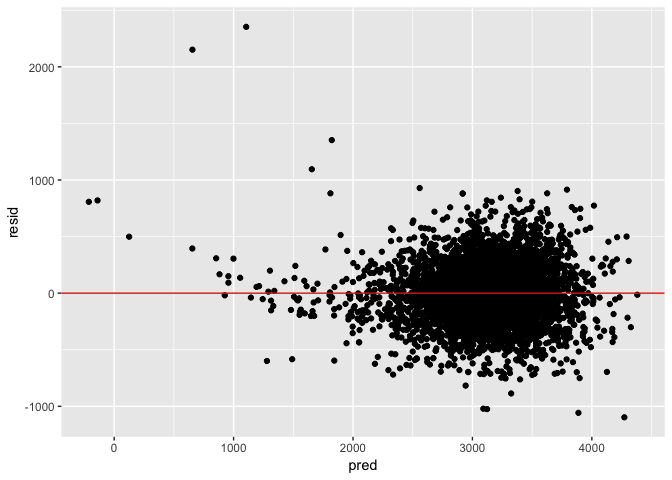
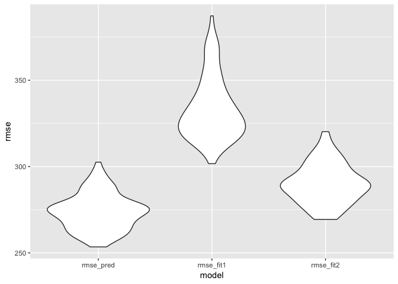

hw6
================
Siyan Chen
11/20/2018

Problem1
========

### import data

``` r
homicide_data = read.csv(text = getURL("https://raw.githubusercontent.com/washingtonpost/data-homicides/master/homicide-data.csv")) %>% 
  janitor::clean_names()
```

### data manipulation

``` r
homicide_data_modify = 
  homicide_data %>%
  mutate(city_state = str_c(city, "_", state),
         solved = str_detect(disposition, "[Cc]losed by arrest"),
         solved = as.numeric(solved)) %>% 
  filter(city_state != "Dallas_TX" & city_state != "Phoenix_AZ" & city_state != "Kansas City_MO" & city_state != "Tulsa_AL") %>% 
  mutate(victim_race = ifelse(victim_race == "White", "White", "Non_White"),
         victim_race = as.factor(victim_race),
         victim_race = fct_relevel(victim_race,"White"),
         victim_age = as.numeric(victim_age))
head(homicide_data_modify)
```

    ##          uid reported_date victim_last victim_first victim_race victim_age
    ## 1 Alb-000001      20100504      GARCIA         JUAN   Non_White         79
    ## 2 Alb-000002      20100216     MONTOYA      CAMERON   Non_White         12
    ## 3 Alb-000003      20100601 SATTERFIELD      VIVIANA       White         10
    ## 4 Alb-000004      20100101    MENDIOLA       CARLOS   Non_White         29
    ## 5 Alb-000005      20100102        MULA       VIVIAN       White         73
    ## 6 Alb-000006      20100126        BOOK    GERALDINE       White         94
    ##   victim_sex        city state      lat       lon           disposition
    ## 1       Male Albuquerque    NM 35.09579 -106.5386 Closed without arrest
    ## 2       Male Albuquerque    NM 35.05681 -106.7153      Closed by arrest
    ## 3     Female Albuquerque    NM 35.08609 -106.6956 Closed without arrest
    ## 4       Male Albuquerque    NM 35.07849 -106.5561      Closed by arrest
    ## 5     Female Albuquerque    NM 35.13036 -106.5810 Closed without arrest
    ## 6     Female Albuquerque    NM 35.15111 -106.5378        Open/No arrest
    ##       city_state solved
    ## 1 Albuquerque_NM      0
    ## 2 Albuquerque_NM      1
    ## 3 Albuquerque_NM      0
    ## 4 Albuquerque_NM      1
    ## 5 Albuquerque_NM      0
    ## 6 Albuquerque_NM      0

### Regression Model

``` r
Balti_df = homicide_data_modify %>% 
  filter(city_state == "Baltimore_MD") 

fit_logistic = 
  Balti_df %>% glm(solved ~victim_age + victim_sex + victim_race, data = ., family = binomial(logit))

# fit logistic model

output_Balti = 
  fit_logistic %>% 
  broom::tidy() %>% 
  mutate(log_OR = estimate,
         OR = exp(estimate)) %>% 
  select(term, log_OR, OR, p.value)

ci_Balti = exp(confint (fit_logistic)) %>% as.data.frame()
### get the confidence interval for odds ratio
rownames(ci_Balti) = NULL
### get ride of row name
cbind(output_Balti, ci_Balti) %>% 
  select(-p.value) %>% 
  filter(term == "victim_raceNon_White") %>% 
  knitr::kable(digits = 3)
```

| term                   |  log\_OR|     OR|  2.5 %|  97.5 %|
|:-----------------------|--------:|------:|------:|-------:|
| victim\_raceNon\_White |   -0.793|  0.453|  0.321|   0.636|

According to the output, the odds ratio for solving homicides comparing non\_white civtims to white victims is 0.453. We are 95% confident that the odds ratio for olving homicides comparing non\_white civtims to white victims is somewhere between 0.321 and 0.636

### GLM for Each City

``` r
homicide_glm =
  homicide_data_modify %>% 
  group_by(city_state) %>% 
  nest() %>% 
  mutate(models = map(data, ~glm(solved ~ victim_age + victim_sex + victim_race, data = .x, family = binomial())), parameters = map(models, broom::tidy)) %>% 
  select(-data) %>% 
  mutate(ci = map(models, confint),
         results = map2(parameters, ci, cbind)) %>% 
  unnest(results) %>% 
  filter(term == "victim_raceNon_White") %>% 
  mutate(OR =exp(estimate)) %>% 
  select(-std.error, -statistic, -p.value, -term, -estimate) %>% 
  rename(confi_low  = `2.5 %`, confi_high = `97.5 %`) %>% 
  mutate(confi_low = exp(confi_low), confi_high = exp(confi_high))

homicide_glm %>% 
  knitr::kable(digits = 3)
```

| city\_state        |  confi\_low|  confi\_high|     OR|
|:-------------------|-----------:|------------:|------:|
| Albuquerque\_NM    |       0.416|        1.124|  0.686|
| Atlanta\_GA        |       0.433|        1.320|  0.767|
| Baltimore\_MD      |       0.321|        0.636|  0.453|
| Baton Rouge\_LA    |       0.299|        1.380|  0.656|
| Birmingham\_AL     |       0.619|        1.759|  1.047|
| Boston\_MA         |       0.045|        0.272|  0.121|
| Buffalo\_NY        |       0.243|        0.811|  0.447|
| Charlotte\_NC      |       0.318|        0.931|  0.555|
| Chicago\_IL        |       0.442|        0.751|  0.575|
| Cincinnati\_OH     |       0.186|        0.554|  0.327|
| Columbus\_OH       |       0.657|        1.191|  0.884|
| Denver\_CO         |       0.352|        0.998|  0.594|
| Detroit\_MI        |       0.495|        0.881|  0.661|
| Durham\_NC         |       0.446|        2.851|  1.153|
| Fort Worth\_TX     |       0.563|        1.286|  0.853|
| Fresno\_CA         |       0.228|        0.861|  0.457|
| Houston\_TX        |       0.738|        1.148|  0.921|
| Indianapolis\_IN   |       0.389|        0.681|  0.516|
| Jacksonville\_FL   |       0.519|        0.891|  0.681|
| Las Vegas\_NV      |       0.613|        1.012|  0.788|
| Long Beach\_CA     |       0.404|        1.702|  0.843|
| Los Angeles\_CA    |       0.523|        0.980|  0.718|
| Louisville\_KY     |       0.286|        0.650|  0.434|
| Memphis\_TN        |       0.536|        1.194|  0.807|
| Miami\_FL          |       0.379|        0.879|  0.577|
| Milwaukee\_wI      |       0.417|        1.022|  0.660|
| Minneapolis\_MN    |       0.351|        1.248|  0.667|
| Nashville\_TN      |       0.647|        1.225|  0.892|
| New Orleans\_LA    |       0.325|        0.801|  0.511|
| New York\_NY       |       0.279|        1.019|  0.548|
| Oakland\_CA        |       0.101|        0.427|  0.217|
| Oklahoma City\_OK  |       0.503|        1.005|  0.711|
| Omaha\_NE          |       0.096|        0.317|  0.180|
| Philadelphia\_PA   |       0.498|        0.873|  0.662|
| Pittsburgh\_PA     |       0.162|        0.498|  0.290|
| Richmond\_VA       |       0.162|        1.204|  0.488|
| San Antonio\_TX    |       0.466|        1.036|  0.698|
| Sacramento\_CA     |       0.442|        1.330|  0.774|
| Savannah\_GA       |       0.308|        1.311|  0.644|
| San Bernardino\_CA |       0.427|        2.134|  0.946|
| San Diego\_CA      |       0.264|        0.699|  0.434|
| San Francisco\_CA  |       0.288|        0.718|  0.458|
| St. Louis\_MO      |       0.423|        0.850|  0.601|
| Stockton\_CA       |       0.205|        0.747|  0.395|
| Tampa\_FL          |       0.611|        2.299|  1.185|
| Tulsa\_OK          |       0.400|        0.850|  0.586|
| Washington\_DC     |       0.258|        1.020|  0.527|

### plot

``` r
homicide_glm %>% 
  mutate(city_state = fct_reorder(city_state, desc(OR))) %>% 
  ggplot(aes(x = city_state, y = OR)) + 
  geom_point() + 
  geom_errorbar(aes(ymax = confi_high, ymin = confi_low)) +
  theme(axis.text.x = element_text(angle = 45, hjust = 1))
```


Comment: Tampa\_FL has the highest odds ratio for solving homicides comparing non-white victim to white victims while Boston\_MA has the lowest odds ratio. Durham\_NC has odds ratio with greatest CI range.

Problem 2
=========

### Data Input and Tidy

``` r
birth_df = read_csv("./data/birthweight.csv") %>% 
  janitor::clean_names() %>% 
  mutate(babysex = as.factor(babysex),
         frace = as.factor(frace),
         malform = as.factor(malform),
         mrace = as.factor(mrace))
```

    ## Parsed with column specification:
    ## cols(
    ##   .default = col_integer(),
    ##   gaweeks = col_double(),
    ##   ppbmi = col_double(),
    ##   smoken = col_double()
    ## )

    ## See spec(...) for full column specifications.

``` r
# change appropriate term from numeric to factor

is.na(birth_df)
# check for NA and there is no NA
```

### Model builting

``` r
mult.fit = lm(bwt ~., data = birth_df)
pred_reg = step(mult.fit, direction = 'both')
```

    ## Start:  AIC=48717.83
    ## bwt ~ babysex + bhead + blength + delwt + fincome + frace + gaweeks + 
    ##     malform + menarche + mheight + momage + mrace + parity + 
    ##     pnumlbw + pnumsga + ppbmi + ppwt + smoken + wtgain
    ## 
    ## 
    ## Step:  AIC=48717.83
    ## bwt ~ babysex + bhead + blength + delwt + fincome + frace + gaweeks + 
    ##     malform + menarche + mheight + momage + mrace + parity + 
    ##     pnumlbw + pnumsga + ppbmi + ppwt + smoken
    ## 
    ## 
    ## Step:  AIC=48717.83
    ## bwt ~ babysex + bhead + blength + delwt + fincome + frace + gaweeks + 
    ##     malform + menarche + mheight + momage + mrace + parity + 
    ##     pnumlbw + ppbmi + ppwt + smoken
    ## 
    ## 
    ## Step:  AIC=48717.83
    ## bwt ~ babysex + bhead + blength + delwt + fincome + frace + gaweeks + 
    ##     malform + menarche + mheight + momage + mrace + parity + 
    ##     ppbmi + ppwt + smoken
    ## 
    ##            Df Sum of Sq       RSS   AIC
    ## - frace     4    124365 320848704 48712
    ## - malform   1      1419 320725757 48716
    ## - ppbmi     1      6346 320730684 48716
    ## - momage    1     28661 320752999 48716
    ## - mheight   1     66886 320791224 48717
    ## - menarche  1    111679 320836018 48717
    ## - ppwt      1    131132 320855470 48718
    ## <none>                  320724338 48718
    ## - fincome   1    193454 320917792 48718
    ## - parity    1    413584 321137922 48721
    ## - mrace     3    868321 321592659 48724
    ## - babysex   1    853796 321578134 48727
    ## - gaweeks   1   4611823 325336161 48778
    ## - smoken    1   5076393 325800732 48784
    ## - delwt     1   8008891 328733230 48823
    ## - blength   1 102050296 422774634 49915
    ## - bhead     1 106535716 427260054 49961
    ## 
    ## Step:  AIC=48711.51
    ## bwt ~ babysex + bhead + blength + delwt + fincome + gaweeks + 
    ##     malform + menarche + mheight + momage + mrace + parity + 
    ##     ppbmi + ppwt + smoken
    ## 
    ##            Df Sum of Sq       RSS   AIC
    ## - malform   1      1447 320850151 48710
    ## - ppbmi     1      6975 320855679 48710
    ## - momage    1     28379 320877083 48710
    ## - mheight   1     69502 320918206 48710
    ## - menarche  1    115708 320964411 48711
    ## - ppwt      1    133961 320982665 48711
    ## <none>                  320848704 48712
    ## - fincome   1    194405 321043108 48712
    ## - parity    1    414687 321263390 48715
    ## + frace     4    124365 320724338 48718
    ## - babysex   1    852133 321700837 48721
    ## - gaweeks   1   4625208 325473911 48772
    ## - smoken    1   5036389 325885093 48777
    ## - delwt     1   8013099 328861802 48817
    ## - mrace     3  13540415 334389119 48885
    ## - blength   1 101995688 422844392 49908
    ## - bhead     1 106662962 427511666 49956
    ## 
    ## Step:  AIC=48709.53
    ## bwt ~ babysex + bhead + blength + delwt + fincome + gaweeks + 
    ##     menarche + mheight + momage + mrace + parity + ppbmi + ppwt + 
    ##     smoken
    ## 
    ##            Df Sum of Sq       RSS   AIC
    ## - ppbmi     1      6928 320857079 48708
    ## - momage    1     28660 320878811 48708
    ## - mheight   1     69320 320919470 48708
    ## - menarche  1    116027 320966177 48709
    ## - ppwt      1    133894 320984044 48709
    ## <none>                  320850151 48710
    ## - fincome   1    193784 321043934 48710
    ## + malform   1      1447 320848704 48712
    ## - parity    1    414482 321264633 48713
    ## + frace     4    124393 320725757 48716
    ## - babysex   1    851279 321701430 48719
    ## - gaweeks   1   4624003 325474154 48770
    ## - smoken    1   5035195 325885346 48775
    ## - delwt     1   8029079 328879230 48815
    ## - mrace     3  13553320 334403471 48883
    ## - blength   1 102009225 422859375 49906
    ## - bhead     1 106675331 427525481 49954
    ## 
    ## Step:  AIC=48707.63
    ## bwt ~ babysex + bhead + blength + delwt + fincome + gaweeks + 
    ##     menarche + mheight + momage + mrace + parity + ppwt + smoken
    ## 
    ##            Df Sum of Sq       RSS   AIC
    ## - momage    1     29211 320886290 48706
    ## - menarche  1    117635 320974714 48707
    ## <none>                  320857079 48708
    ## - fincome   1    195199 321052278 48708
    ## + ppbmi     1      6928 320850151 48710
    ## + malform   1      1400 320855679 48710
    ## - parity    1    412984 321270064 48711
    ## + frace     4    125020 320732060 48714
    ## - babysex   1    850020 321707099 48717
    ## - mheight   1   1078673 321935752 48720
    ## - ppwt      1   2934023 323791103 48745
    ## - gaweeks   1   4621504 325478583 48768
    ## - smoken    1   5039368 325896447 48773
    ## - delwt     1   8024939 328882018 48813
    ## - mrace     3  13551444 334408523 48881
    ## - blength   1 102018559 422875638 49904
    ## - bhead     1 106821342 427678421 49953
    ## 
    ## Step:  AIC=48706.02
    ## bwt ~ babysex + bhead + blength + delwt + fincome + gaweeks + 
    ##     menarche + mheight + mrace + parity + ppwt + smoken
    ## 
    ##            Df Sum of Sq       RSS   AIC
    ## - menarche  1    100121 320986412 48705
    ## <none>                  320886290 48706
    ## - fincome   1    240800 321127090 48707
    ## + momage    1     29211 320857079 48708
    ## + ppbmi     1      7479 320878811 48708
    ## + malform   1      1678 320884612 48708
    ## - parity    1    431433 321317724 48710
    ## + frace     4    124743 320761547 48712
    ## - babysex   1    841278 321727568 48715
    ## - mheight   1   1076739 321963029 48719
    ## - ppwt      1   2913653 323799943 48743
    ## - gaweeks   1   4676469 325562760 48767
    ## - smoken    1   5045104 325931394 48772
    ## - delwt     1   8000672 328886962 48811
    ## - mrace     3  14667730 335554021 48894
    ## - blength   1 101990556 422876847 49902
    ## - bhead     1 106864308 427750598 49952
    ## 
    ## Step:  AIC=48705.38
    ## bwt ~ babysex + bhead + blength + delwt + fincome + gaweeks + 
    ##     mheight + mrace + parity + ppwt + smoken
    ## 
    ##            Df Sum of Sq       RSS   AIC
    ## <none>                  320986412 48705
    ## + menarche  1    100121 320886290 48706
    ## - fincome   1    245637 321232048 48707
    ## + momage    1     11698 320974714 48707
    ## + ppbmi     1      8823 320977589 48707
    ## + malform   1      1884 320984528 48707
    ## - parity    1    422770 321409181 48709
    ## + frace     4    128726 320857686 48712
    ## - babysex   1    846134 321832545 48715
    ## - mheight   1   1012240 321998651 48717
    ## - ppwt      1   2907049 323893461 48743
    ## - gaweeks   1   4662501 325648912 48766
    ## - smoken    1   5073849 326060260 48771
    ## - delwt     1   8137459 329123871 48812
    ## - mrace     3  14683609 335670021 48894
    ## - blength   1 102191779 423178191 49903
    ## - bhead     1 106779754 427766166 49950

``` r
summary(pred_reg)
```

    ## 
    ## Call:
    ## lm(formula = bwt ~ babysex + bhead + blength + delwt + fincome + 
    ##     gaweeks + mheight + mrace + parity + ppwt + smoken, data = birth_df)
    ## 
    ## Residuals:
    ##      Min       1Q   Median       3Q      Max 
    ## -1097.18  -185.52    -3.39   174.14  2353.44 
    ## 
    ## Coefficients:
    ##               Estimate Std. Error t value Pr(>|t|)    
    ## (Intercept) -6098.8219   137.5463 -44.340  < 2e-16 ***
    ## babysex2       28.5580     8.4549   3.378 0.000737 ***
    ## bhead         130.7770     3.4466  37.944  < 2e-16 ***
    ## blength        74.9471     2.0190  37.120  < 2e-16 ***
    ## delwt           4.1067     0.3921  10.475  < 2e-16 ***
    ## fincome         0.3180     0.1747   1.820 0.068844 .  
    ## gaweeks        11.5925     1.4621   7.929 2.79e-15 ***
    ## mheight         6.5940     1.7849   3.694 0.000223 ***
    ## mrace2       -138.7925     9.9071 -14.009  < 2e-16 ***
    ## mrace3        -74.8868    42.3146  -1.770 0.076837 .  
    ## mrace4       -100.6781    19.3247  -5.210 1.98e-07 ***
    ## parity         96.3047    40.3362   2.388 0.017004 *  
    ## ppwt           -2.6756     0.4274  -6.261 4.20e-10 ***
    ## smoken         -4.8434     0.5856  -8.271  < 2e-16 ***
    ## ---
    ## Signif. codes:  0 '***' 0.001 '**' 0.01 '*' 0.05 '.' 0.1 ' ' 1
    ## 
    ## Residual standard error: 272.3 on 4328 degrees of freedom
    ## Multiple R-squared:  0.7181, Adjusted R-squared:  0.7173 
    ## F-statistic: 848.1 on 13 and 4328 DF,  p-value: < 2.2e-16

``` r
df1 = modelr::add_residuals(birth_df, pred_reg)
df2 = modelr::add_predictions(birth_df, pred_reg)
df = merge(df1, df2)

df %>%
  ggplot(aes(x = pred, y = resid)) + geom_point() + geom_hline(yintercept = 0, color = "red")
```



I start with full model and use stepwise selection to get my predict model to be: lm(formula = bwt ~ babysex + bhead + blength + delwt + fincome + gaweeks + mheight + mrace + parity + ppwt + smoken, data = birth\_df)

``` r
fit1 = lm(bwt ~ blength + gaweeks, data = birth_df)
summary(fit1)
```

    ## 
    ## Call:
    ## lm(formula = bwt ~ blength + gaweeks, data = birth_df)
    ## 
    ## Residuals:
    ##     Min      1Q  Median      3Q     Max 
    ## -1709.6  -215.4   -11.4   208.2  4188.8 
    ## 
    ## Coefficients:
    ##              Estimate Std. Error t value Pr(>|t|)    
    ## (Intercept) -4347.667     97.958  -44.38   <2e-16 ***
    ## blength       128.556      1.990   64.60   <2e-16 ***
    ## gaweeks        27.047      1.718   15.74   <2e-16 ***
    ## ---
    ## Signif. codes:  0 '***' 0.001 '**' 0.01 '*' 0.05 '.' 0.1 ' ' 1
    ## 
    ## Residual standard error: 333.2 on 4339 degrees of freedom
    ## Multiple R-squared:  0.5769, Adjusted R-squared:  0.5767 
    ## F-statistic:  2958 on 2 and 4339 DF,  p-value: < 2.2e-16

``` r
fit2 = lm(bwt ~ bhead*blength*babysex, data = birth_df)
summary(fit2)
```

    ## 
    ## Call:
    ## lm(formula = bwt ~ bhead * blength * babysex, data = birth_df)
    ## 
    ## Residuals:
    ##      Min       1Q   Median       3Q      Max 
    ## -1132.99  -190.42   -10.33   178.63  2617.96 
    ## 
    ## Coefficients:
    ##                          Estimate Std. Error t value Pr(>|t|)    
    ## (Intercept)            -7176.8170  1264.8397  -5.674 1.49e-08 ***
    ## bhead                    181.7956    38.0542   4.777 1.84e-06 ***
    ## blength                  102.1269    26.2118   3.896 9.92e-05 ***
    ## babysex2                6374.8684  1677.7669   3.800 0.000147 ***
    ## bhead:blength             -0.5536     0.7802  -0.710 0.478012    
    ## bhead:babysex2          -198.3932    51.0917  -3.883 0.000105 ***
    ## blength:babysex2        -123.7729    35.1185  -3.524 0.000429 ***
    ## bhead:blength:babysex2     3.8781     1.0566   3.670 0.000245 ***
    ## ---
    ## Signif. codes:  0 '***' 0.001 '**' 0.01 '*' 0.05 '.' 0.1 ' ' 1
    ## 
    ## Residual standard error: 287.7 on 4334 degrees of freedom
    ## Multiple R-squared:  0.6849, Adjusted R-squared:  0.6844 
    ## F-statistic:  1346 on 7 and 4334 DF,  p-value: < 2.2e-16

### Cross\_Validation

``` r
cv_df = crossv_mc(birth_df, 100) %>% 
  mutate(train = map(train, as.tibble),
         test = map(test, as.tibble))
### create column list for train and test

cv_df =
  cv_df %>% 
  mutate(pred_reg = map(train, ~lm(formula = bwt ~ babysex + bhead + blength + delwt + fincome + gaweeks + mheight + mrace + parity + ppwt + smoken, data = .x)), 
         fit1 = map(train, ~lm(bwt ~ blength + gaweeks, data = .x)),
         fit2 = map(train, ~lm(bwt ~ bhead*blength*babysex, data = .x)))%>% 
  mutate(rmse_pred = map2_dbl(pred_reg, test, ~ rmse(model = .x, data = .y)),
         rmse_fit1 = map2_dbl(fit1, test, ~ rmse(model = .x, data = .y)),
         rmse_fit2 = map2_dbl(fit2, test, ~ rmse(model = .x, data = .y)))
```

    ## Warning in predict.lm(model, data): prediction from a rank-deficient fit
    ## may be misleading

    ## Warning in predict.lm(model, data): prediction from a rank-deficient fit
    ## may be misleading

``` r
### Map the three model to each list of train and use test to obtain rmse

cv_df %>% 
  select(starts_with("rmse")) %>% 
  gather(key = model, value = 1:3) %>% 
  mutate(model = as.factor(model),
         model = fct_inorder(model)) %>%
  rename(rmse = `1:3`) %>% 
  ggplot(aes(x = model, y = rmse)) + geom_violin()
```



``` r
### make plot of rmse for each model
```

Comment: The rmse plot suggests the predictive model is better than the fit1 (which is the main effects only model) and fit2 (which is three-way interaction) and model fit1 is better than model fit2.
